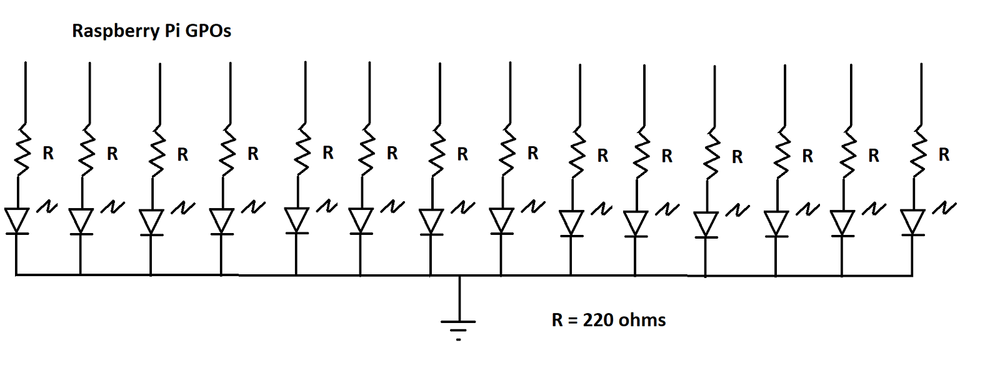
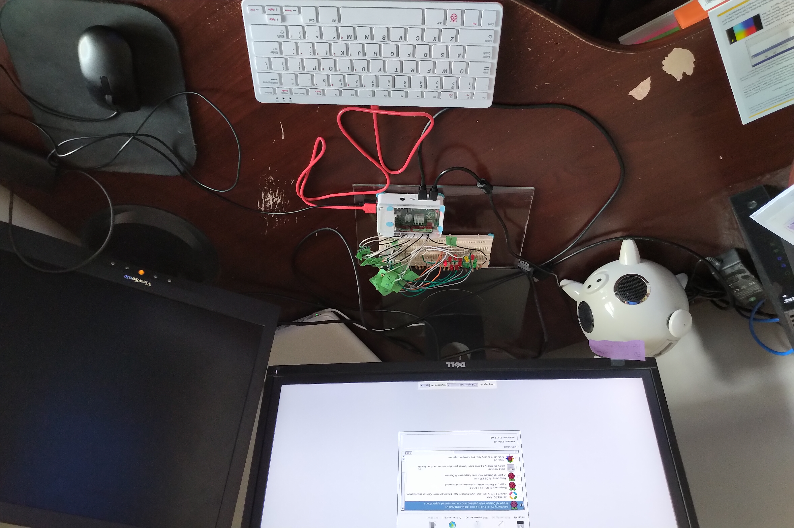

# Raspberry Pi Journal

## Table of Contents

[Purchase](#purchase)

[Preparation](#preparation)

[Initial Setup](#initial-setup)

[Python Programs](#python-on-the-pi)

## Purchase

Raspberry Pi Model 4B

https://www.canakit.com/raspberry-pi-4-complete-starter-kit.html
Prices in Canadian dollars:

* Full starter kit for 8GB pi: $194.95
* Shipping: $16.95
* HST: $27.54
* Total: $239.44

The kit arrived intact within a week or so.  Great start!

## Preparation

I searched through my electronics kits from college, found my breadboard, LEDs and resistors.
I considered making a program to control a 7-segment display,
but didn't have a 7-seg handy. I improvised a home-made version consisting of two LEDs per segment,
resulting in 14 LEDs with series resistors.

Remember the resistor colour code?

* Black = 0, Brown = 1, Red = 2, Orange = 3
* Yellow = 4,  Green = 5, Blue = 6,
* Violet = 7, Grey = 8, White = 9.

First band = first digit

Second band = second digit

Third band = multiplier (power of 10)

Fourth band = tolerance: Gold = 5%, Silver = 10%

Example: red, red, brown, gold

22 * 10^1 = 220 ohms +/- 5%

## Initial Setup

I assembled the Pi according to the Canakit instructions.
Added the heatsinks but set the fan aside for now.
Will attach the fan later if doing CPU-intensive work.
Inserted the provided SD card containing the NOOBS boot loader.

To protect the PCB while keeping the GPIO header accessible, I removed the case lid.
I cut a piece of transparent plexiglass to size, and sanded the edges and corners.
I stuck the plexiglass to the PI case with plasticine.
This protects the board while leaving the GPIOs accessible.
I Fastened the Pi and Breadboard to a sheet of plexiglass.

Connected HDMI, USB keyboard, mouse

Time to power up!

I plugged the power adapter into my power bar, and and the USB C end into the PI, 
within a few seconds got the OS selector screen.
Selected the recommended "Raspberry Pi OS Full (32-bit)"
This took ~10 minutes and completed successfully.

Rasbpian booted - success!
I stepped through the configuration, and connected to my home Wi-Fi network.
Next, the setup wizard downloaded OS and application updates - this took a while...

I also enabled SSH on on the Pi so that I can transfer files to and from it via SCP, 
and control it from my other workstation.

## Python on the Pi

### First GPIO Program

The Raspberry Pi OS image included [Thonny](https://thonny.org/), a simple and friendly Python IDE.
I flipped the mode from basic to standard, tweaked the font size to be a littler smaller and started a first program 
to control the LEDs.  Here is the first [simple utility](gpo-utility). 

### More GPIO Fun - Morse Code Transmitter

Building on the idea of the previous GPO tester, I decided to make a simple utility to 
transmit a string via blinking [Morse Code](morse-code-transmitter) on the LEDs.  
Not the most advanced broadband communications system, but a fun learning opportunity nonetheless.
This one makes use of 
[basic threading operations](https://docs.python.org/3/library/threading.html#threading.Thread) 
and a [simple queue](https://docs.python.org/3/library/queue.html) 
to allow gracefully breaking out of the transmit loop.  